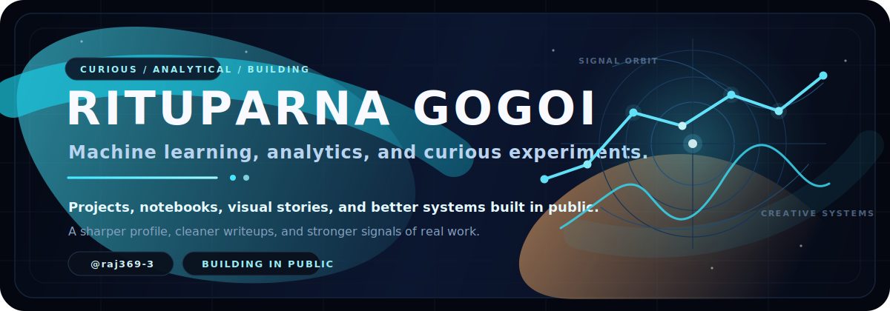

# <div align="center">`raj369-3`</div>

<p align="center">
  
</p>

<p align="center">
  
</p>

<p align="center">
  <a href="https://github.com/raj369-3">
    
  </a>
  <a href="https://www.linkedin.com/in/replace-this-link">
    
  </a>
  <a href="mailto:replace-this@email.com">
    
  </a>
</p>

<p align="center">
  <strong>Frontend & Full-Stack Developer</strong><br />
  I build polished digital experiences with a bias for clean code, visual clarity, and practical impact.
</p>

---

## Hero

<table>
  <tr>
    <td width="60%" valign="top">

### What I Bring

- Strong frontend instincts with a focus on responsive, modern interfaces.
- Product-minded development that balances clean UX with maintainable code.
- Fast execution for portfolio work, landing pages, dashboards, and app surfaces.
- A growth-oriented workflow: shipping in public, improving continuously, and learning by building.

### Primary Links

- Profile: [github.com/raj369-3](https://github.com/raj369-3)
- Portfolio: `replace-with-your-portfolio-link`
- Resume: `replace-with-your-resume-link`

    </td>
    <td width="40%" valign="top">

```text
CURRENT SIGNAL
--------------
Role Target  : Frontend / Web Developer
Availability : Open to internships and opportunities
Strengths    : UI Craft, Responsiveness, Shipping Fast
Focus        : React, JavaScript, TypeScript, Node
Status       : Building a stronger public portfolio
```

   </td>
  </tr>
</table>

---

## About / Current Focus

```text
I am using this profile as a public build log for the kind of work I want to be hired for:
clean interfaces, modern frontend systems, thoughtful interactions, and projects that
look sharp without sacrificing clarity or maintainability.
```

- Building recruiter-friendly projects that show product sense, not just code output.
- Improving frontend depth across React, TypeScript, design systems, and animation.
- Turning personal work into stronger case-study material for internships and jobs.
- Replacing every placeholder in this README with real proof: shipped repos, live demos, and measurable outcomes.

---

## Tech Stack

<p>
  
</p>

| Layer | Tools |
| --- | --- |
| Core Web | HTML, CSS, JavaScript, TypeScript |
| Frontend | React, Next.js, Tailwind CSS, Bootstrap |
| Backend | Node.js, Express |
| Data / Cloud | MongoDB, Firebase |
| Workflow | Git, GitHub, VS Code, Figma |

---

## Featured Projects

> Replace the placeholder entries below with your best 3 to 6 repositories once they are live.

| Project | What It Demonstrates | Status |
| --- | --- | --- |
| [Project Neon Canvas](https://github.com/raj369-3?tab=repositories) | A visually strong frontend build that proves layout, animation, and responsive execution. | Placeholder |
| [Project Signal Board](https://github.com/raj369-3?tab=repositories) | A dashboard or app-style project showing practical UI structure and component thinking. | Placeholder |
| [Project Launch Page](https://github.com/raj369-3?tab=repositories) | A conversion-focused landing page that shows polish, hierarchy, and performance awareness. | Placeholder |
| [Project Full-Stack Build](https://github.com/raj369-3?tab=repositories) | An end-to-end app that proves API handling, auth/data flows, and deployable structure. | Placeholder |

### What Good Replacements Should Show

- One project with strong visual craft.
- One project with app logic or dashboard complexity.
- One project with real-world polish: auth, forms, data, or deployment.
- Prefer fewer strong repos over many average ones.

---

## GitHub Activity / Stats

<p align="center">
  
  
</p>

<p align="center">
  
  
</p>

<p align="center">
  
</p>

> If the contribution snake does not appear yet, run the `Generate Snake` workflow after the first push.

---

## Contact

<table>
  <tr>
    <td width="50%" valign="top">

### Open To

- Frontend internships
- Web developer roles
- Freelance landing page and portfolio work
- Collaboration with serious builders

    </td>
    <td width="50%" valign="top">

### Reach Me

- GitHub: [@raj369-3](https://github.com/raj369-3)
- LinkedIn: `replace-with-your-linkedin`
- Email: `replace-with-your-email`
- Portfolio: `replace-with-your-portfolio`

   </td>
  </tr>
</table>

---

<p align="center">
  <strong>Design note:</strong> This README is intentionally structured like a compact personal landing page:
  one strong hero, clear signals for recruiters, controlled widgets, and room to swap placeholders for real proof.
</p>
