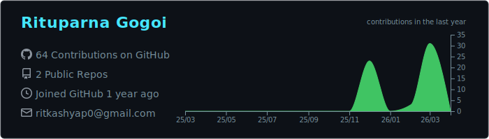
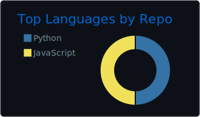

  

<h1 align="center">Rituparna Gogoi</h1>

  IIT Madras · Machine Learning · Analytics · Visual Storytelling

  <em>"Turning messy datasets into readable stories, useful models, and sharper project work."</em>

  
  
  

  Building machine learning projects, cleaner analyses, and public writeups that are easy to follow.

---

## About Me

> I care more about clarity than noise: fewer projects, better execution, and stronger explanations.

- I study Data Science at IIT Madras and use GitHub as a public log of how I think, build, and improve.
- I like structured experimentation, readable project work, and results that can be explained without unnecessary jargon.
- Right now, I am focused on turning coursework and side projects into stronger, portfolio-ready repositories.

---

## Toolkit

> The tools I reach for most often when working with data, models, and visual explanations.

  

  <code>Python</code> <code>pandas</code> <code>NumPy</code> <code>scikit-learn</code> <code>TensorFlow</code> <code>PyTorch</code> <code>SQL</code> <code>Jupyter</code> <code>Plotly</code> <code>Git</code> <code>Linux</code>

---

## GitHub Activity

> A quick snapshot of the work and activity behind this profile.

  

  
  

  

---

## Random Dev Quote

  

